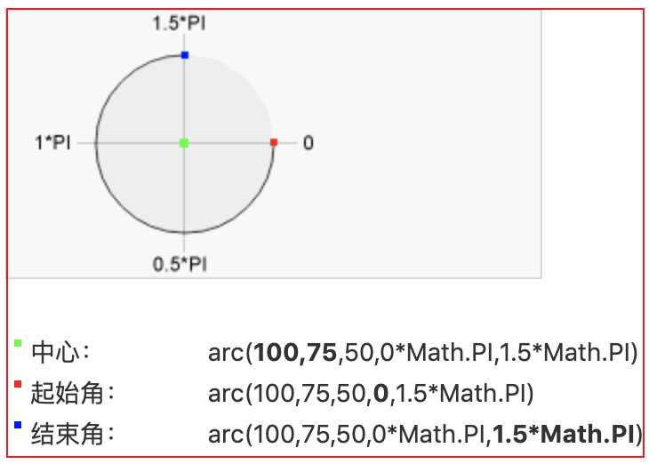
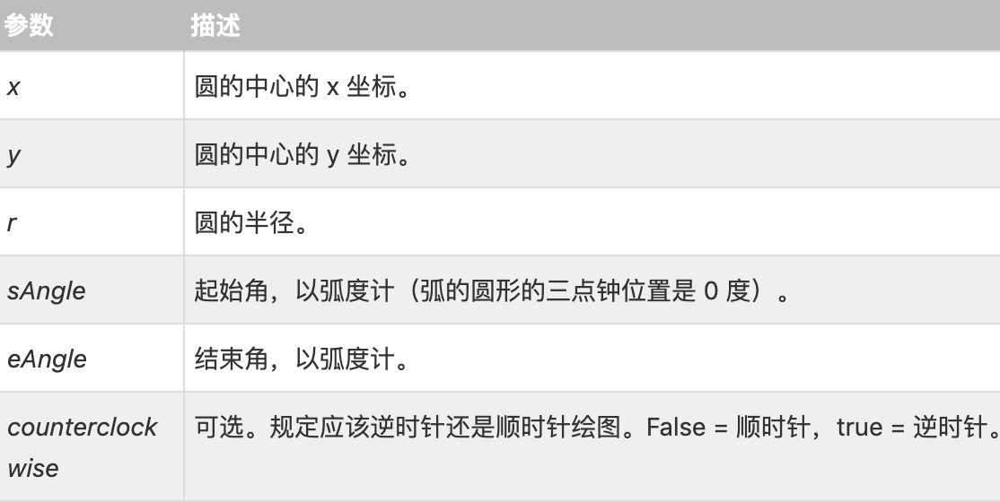

# canvas 画布

- 可以做统计图
- 可以做数据展示
- 可以做 h5 端小游戏

# 1 绘图工具

- 设置画布大小：使用元素属性设置，不能通过 css 样式设置；因为 css 样式设置的大小不是画布实际的大小所以会失真

```html
<!-- 示例1： -->
<!-- 不可以使用css样式设置大小 -->
<style>
  canvas {
    width: 300px;
  }
</style>

<!-- 使用元素属性设置大小 -->
<canvas width="300" height="300"></canvas>
```

# 2 绘图方法
+ 备注：canvas 的左上角坐标为 (0,0)
+ 获取平面对象：`getContext("2d")`
    - 拥有多种绘制路径、矩形、圆形、字符以及添加图像的方法
+ 落笔开始坐标：`moveTo(x, y)`
+ 结束坐标：`lineTo(x, y)`
+ 划线：`stroke()`
    - 每调用一次描边浏览器都会重新渲染一次页面
    - 解决办法1：画满图层之后只使用一次描边`stroke()`
    - 解决办法2：使用 `beginPath()` 新建图层
+ 新建图层：`beginPath()` 
+ 演示：`strokeStyle="值"`
+ 线宽：`lineWidth = "值"` 不需要单位
+ 线连接方式：`lineJoin：round | bevel | miter(默认)`
+ 线帽（线两段结束方式）：`lineCap：butt(默认) | round | square`
+ 闭合路径：`ctx.closePath();` 最后一条边可以不用画直接用闭合路径方法就可以

```html
<!-- 示例1： -->
  <body>
      <!-- 创建画布对象 -->
    <canvas width="300" height="300"></canvas>
    <script>
		// 获取画布对象
        var canvas = document.querySelector("canvas");
		// 获取画图上下文
		var cts = canvas.getContext("2d");

		// 第一步：落笔点
		cts.moveTo(100, 100);
		// 第二步：划线：以上次画笔的落笔点为起始点
		cts.lineTo(100, 200);
		cts.lineTo(200, 200);
		cts.lineTo(100, 100);
		// 设置线为红色
		cts.strokeStyle = "red";
        // 线宽：不需要单位
        // cts.lineWidth = "10";
		// 第三步：描边	——>  每调用一次描边浏览器都会重新渲染一次页面
		cts.stroke();
        // 新建图层
        // cts.beginPath();

    </script>
  </body>
```
```js
// 示例1：闭合路径
// 落笔点
ctx.moveTo(100, 100);
// 划线：以上次画笔的落笔点为起始点
ctx.lineTo(100, 200);
ctx.lineTo(200, 200);

// 闭合路径
ctx.closePath();
```

# 3 渐变方案
+ 渐变可以填充在矩形, 圆形, 线条, 文本等等, 各种形状可以自己定义不同的颜色
## 3.1 线性渐变
+ createLinearGradient(x,y,x1,y1) - 创建线性渐变方案
+ addColorStop(offset, color)    - 添加开始或者结束颜色
    - offset：颜色的开始和结束位置，可以是[0-1]中任意取值
```html
<!-- 示例1： -->
 <body>
    <canvas width="300" height="300"></canvas>
    <script>
		// 获取画布对象
        var canvas = document.querySelector("canvas");
		// 获取画图上下文
		var ctx = canvas.getContext("2d");

		// 创建渐变方案：渐变开始坐标(100，100) 渐变结束坐标(200, 200)
		var clgd = ctx.createLinearGradient(100, 100, 200, 200);
		// 添加开始颜色: 第一个参数是：0至1 的数
		clgd.addColorStop(0, "red");
		// 添加结束颜色
		clgd.addColorStop(1, "blue");

		// 将设置好的方案样式赋值给strokeStyle，然后划线
		ctx.strokeStyle = clgd;
		ctx.lineWidth = "10";
		ctx.moveTo(100, 100);
		ctx.lineTo(200, 200);
		ctx.stroke();
    </script>
  </body>
```
## 3.2 径向渐变
+ 径向渐变就是以圆心开始向外扩散
+ createRadialGradient(x,y,r,x1,y1,r1)  创建一个径向/圆渐变
    - x：表示渐变的开始圆的 x 坐标
    - y：表示渐变的开始圆的 y 坐标
    - r：表示开始圆的半径
    - x1：表示渐变的结束圆的 x 坐标
    - y1：表示渐变的结束圆的 y 坐标
    - r1：表示结束圆的半径
```html
<!-- 示例1： -->
```
# 4 填充效果
## 4.1 基本用法
+ `ctx.fill()`：    填充,默认黑色
+ `ctx.fillStyle`： 设置填充样式属性
```html
<!-- 示例1： -->
  <body>
    <canvas width="300" height="300"></canvas>
    <script>
		// 获取画布对象
        var canvas = document.querySelector("canvas");
		// 获取画图上下文
		var ctx = canvas.getContext("2d");

		ctx.moveTo(100, 100);
		ctx.lineTo(100, 200);
		ctx.lineTo(200, 200);
		ctx.closePath();
		ctx.fillStyle = "blue"
		ctx.fill();

		ctx.stroke();
    </script>
  </body>
```
## 4.2 非零环绕原则
+ 非零环绕原则条件：必须是闭合图形，并且必须是外圈和内圈划线方向不同，一个顺时针另一个逆时针。
+ 比如`回`字环形：内外线如果绘制方向相反，则使用fill填充时，只会填充内外线中间的环形部分


# 5 绘制虚线
+ `ctx.setLineDash([10,5,20]);`：数组中的每项表示实线长度和空白长度；并且循环
```js
// 示例1：
ctx.moveTo(100, 100);
ctx.lineTo(100, 200);
// setLineDash设置虚线
// 实线10，空白5，实线10，空白5....
ctx.setLineDash([10,5]);
ctx.strokeStyle = "red";
ctx.stroke();

ctx.beginPath();
ctx.moveTo(150, 150);
ctx.lineTo(300, 300);
// 实线10，空白5，实线20，空白10，实线5....
ctx.setLineDash([10,5,20]);
ctx.strokeStyle = "blue";
ctx.stroke();
```
# 6 绘制动画效果
## 6.1 绘制矩形
+ `ctx.rect(x, y, w, h)`：绘制矩形模型，只是模型没有划线
+ `ctx.strokeRect(100,100, 200, 200);`：绘制矩形模型带划线
+ `ctx.fillRect(100,100, 200, 200)`：填充矩形(默认黑色)
+ `ctx.clearRect(x, y, w, h)`：清除矩形
```js
// 方法1：
ctx.rect(100,100, 200, 200);
ctx.stroke();

// 方法2：
ctx.strokeRect(100,100, 200, 200);

// 方法3:
ctx.fillRect(100,100, 200, 200);
```
## 6.2 动画效果
+ 步骤1：先清屏
+ 步骤2：绘制图形
+ 步骤3：定时移动图形
+ 步骤4：循环
```html
<!-- 示例1： -->
  <body>
    <canvas width="300" height="300"></canvas>

    <script>
      // 获取画布对象
      var canvas = document.querySelector("canvas");
      // 获取画图上下文
      var ctx = canvas.getContext("2d");

      var step = 5;
      var x = 10;
      var y = 100;
      var rectWidth = 100;
      var rectHeight = 100;
      var timer = setInterval(() => {
        // 移动
        ctx.clearRect(0, 0, canvas.width, canvas.height);
        ctx.fillRect(x, y, rectWidth, rectHeight);
        // 设置停止条件
        x += step;
      }, 100);
    </script>
  </body>
```
# 7 绘制文本
+ `fillText(text,x,y)`: 在 canvas 上绘制实心的文本
+ `strokeText(text,x,y)`: 在 canvas 上绘制空心的文本
+ `font`: 设置字体css的font
+ 文字水平对齐：`ctx.textAlign= "center | left | right"`
+ 文字垂直对齐：`ctx.textBaseline = "bottom | top | middle"`
```js
// 示例1：

// 获取画布对象
var canvas = document.querySelector("canvas");
// 获取画图上下文
var ctx = canvas.getContext("2d");

// 设置阴影颜色
ctx.shadowColor = "red"
// 设置文字阴影模糊度
ctx.shadowBlur = 0.5;
// 设置文字阴影水平偏移量（可通过正负调整）
ctx.shadowOffsetX = 1;
// 设置文字阴影垂直偏移量
ctx.shadowOffsetY = 1;
// 设置字体
ctx.font = "50px 微软雅黑";

// 设置空心文字
ctx.strokeText("hello", 100, 100);
// 设置实体文字
ctx.fillText("Hello World",10,50);
```

# 8 绘制圆弧
+ 语法：context.arc(x,y,r,sAngle,eAngle,counterclockwise);


+ 弧度和角度关系
```js
弧度：角度
0：0度
π/6: 30度
π ： 180度
2π： 360度
```
+ 绘制圆上任一点(前提知道弧度和圆心坐标；求圆上某一点的坐标)
  - x = 圆心x + r*cos(弧度)
  - y = 圆心y + r*sin(弧度)
```js
// 示例1：圆形
var c=document.getElementById("myCanvas");
var ctx=c.getContext("2d");
ctx.beginPath();
ctx.arc(100,75,50,0,2*Math.PI);
ctx.stroke();
```
# 9 绘制图片
+ 解决图片绘制失真公式：`绘制宽: 绘制高 = 原始宽： 原始高`
```js
// 示例1：
// 方式1：将图片绘制到画布指定位置
ctx.drawImage(图片对象, x, y);

// 方式2：将图片绘制到画布指定区域(width和height是画布指定区域宽高)
ctx.drawImage(图片对象, x, y, width, height);

// 方式3：将图片中的指定区域绘制到画布的指定区域
ctx.drawImage(图片对象, sx, sy, swidth, sheight, dx, dy, dwidth, dheight);
```
```js
// 示例1：基本用法

// 获取画布对象
var canvas = document.querySelector("canvas");
// 获取画图上下文
var ctx = canvas.getContext("2d");

var img = document.createElement("img");
img.src = "xxx.jpg"

// 必须图片加载完成才可以绘制
img.onload = function (){
  ctx.drawImage(img, 0, 0);
      }
```

# 10 平移(坐标系圆点的平移)
+ 平移画布原点：`ctx.translate(x,y)`
```js
// 示例1:
var c=document.getElementById("myCanvas");
var ctx=c.getContext("2d");
ctx.fillRect(0,0,100,50);
// 将画布原点平移到70，70位置
ctx.translate(70,70);
ctx.fillRect(0,0,100,50);
```
# 11 旋转(坐标系旋转)
+ context.rotate(弧度);
```js
var c=document.getElementById("myCanvas");
var ctx=c.getContext("2d");
// 旋转
ctx.rotate(20*Math.PI/180);
ctx.fillRect(50,20,100,50);
```
# 12 伸缩
+ context.scale(scalewidth,scaleheight)：缩放当前绘图至更大或更小
  - scalewidth: 缩放当前绘图的宽度（1=100%，0.5=50%，2=200%)
  - scaleheight: 缩放当前绘图的高度（1=100%，0.5=50%，2=200%)
+ 如果您对绘图进行缩放，所有之后的绘图也会被缩放。定位也会被缩放。
```js
// 示例1：
var c=document.getElementById("myCanvas");
var ctx=c.getContext("2d");
ctx.strokeRect(5,5,25,15);
ctx.scale(2,2);
ctx.strokeRect(5,5,25,15);
ctx.scale(2,2);
ctx.strokeRect(5,5,25,15);
ctx.scale(2,2);
ctx.strokeRect(5,5,25,15);
```